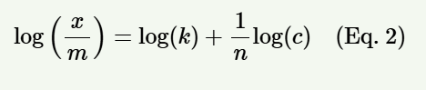

### **Introduction**

Adsorption is a surface phenomenon of solids. It occurs due to the presence of residual or unbalanced forces associated with the surface molecules of solids. These surface molecules attract the molecules/ions of other species that come in contact with them, either in the gas or solution phase. This adhesion of molecules/ions to the surface is known as adsorption,it is of two types one is physical adsorption and the other one is chemical adsorption based on the forces that bind these foreign species to the surfaces molecules. It depends on following factor:  
i) Specific area of the solid  
ii) Solute concentration in solution at equilibrium  
iii) Pressure in case of gaseous adsorption  
iv) Nature of adsorbent  
v) Temperature  

There is a greater concentration of the adsorbed molecules at the solid surface compared to the gas phase or solution phase.The adsorption of a solute from a solution generally follows the Freundlich empirical adsorption isotherm, given by formula:

  

On taking logarithm on both sides:

  

Where:  
x = weight of adsorbate  
m = mass of adsorbent  
k = proportionality constant representing the capacity of the adsorbent  
c = equilibrium concentration of the solution  

If we draw the plots for Eq. 1 and Eq. 2, we get the following graphs:

  
   <strong>Fig. 1: x/m vs p graph</strong>

  
   <strong>Fig. 2: log(x/m) vs log(p) graph</strong>

### **Applications**
1. Water Treatment Optimization  
2. Environmental Monitoring  
3. Industrial Processes  
4. Drinking Water Quality  
5. Research and Education
